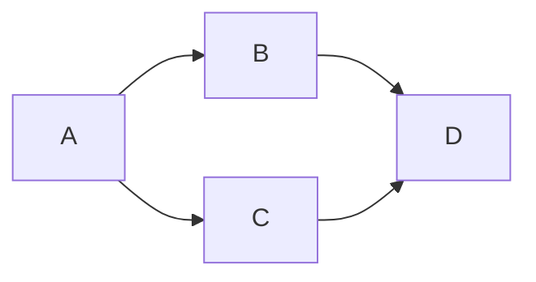

---

title: "INF3105: Présentation du cours"
summary: "Introduction au cours INF3105: Structures de données et Algorithmes"
authors: []
tags: [INF3105]
categories: []
date: '2019-02-05T00:00:00Z'
slides:
  # Choose a theme from https://github.com/hakimel/reveal.js#theming
  theme: black
  highlight_style: dracula
  reveal_options:
    slide_number: c/t
    mouse_wheel: true
    pdf_separate_fragments: false

---

## INF3105: Structures de données et Algorithmes
### Été 2024

[Hugo Blox Builder](https://hugoblox.com/) | [Documentation](https://docs.hugoblox.com/content/slides/)

---

## Test c++

```c++
static void blit(const array<char, 40 * 25>& data) {
  copy(data.begin(), data.end(),
  reinterpret_cast<char*>(0x0400));
}

void draw(Point, string_view);
```

---

## Fragments

Make content appear incrementally

```
{} One {}
{} **Two** {}
{} Three {}
```

Press `Space` to play!

{} One {}
{} **Two** {}
{} Three {}

---



A fragment can accept two optional parameters:

- `class`: use a custom style (requires definition in custom CSS)
- `weight`: sets the order in which a fragment appears

---

## Test

- Item 1
- Item 2

```js [1-2|3|4]
let a = 1;
let b = 2;
let c = x => 1 + 2 + x;
c(3);
```

```python [10: 1-3]
def main():
  print("Hello, World!")
  for i in range(10):
    print(i)
```

---

<!--  -->


## Features

- Efficiently write slides in Markdown
- 3-in-1: Create, Present, and Publish your slides
- Supports speaker notes
- Mobile friendly slides

---

## Controls

- Next: `Right Arrow` or `Space`
- Previous: `Left Arrow`
- Start: `Home`
- Finish: `End`
- Overview: `Esc`
- Speaker notes: `S`
- Fullscreen: `F`
- Zoom: `Alt + Click`
- [PDF Export](https://revealjs.com/pdf-export/)

---

## Code Highlighting

Inline code: `variable`

Code block:

```python
porridge = "blueberry"
if porridge == "blueberry":
    print("Eating...")
```

---

## Math

In-line math: $x + y = z$

Block math:

$$
f\left( x \right) = \frac{{2\left( {x + 4} \right)\left( {x - 4} \right)}}{{\left( {x + 4} \right)\left( {x + 1} \right)}}
$$

---

## Speaker Notes

Add speaker notes to your presentation

```markdown
{}

- Only the speaker can read these notes
- Press `S` key to view
  {}
```

Press the `S` key to view the speaker notes!



- Only the speaker can read these notes
- Press `S` key to view
  

---

## Themes

- black: Black background, white text, blue links (default)
- white: White background, black text, blue links
- league: Gray background, white text, blue links
- beige: Beige background, dark text, brown links
- sky: Blue background, thin dark text, blue links

---

- night: Black background, thick white text, orange links
- serif: Cappuccino background, gray text, brown links
- simple: White background, black text, blue links
- solarized: Cream-colored background, dark green text, blue links

---



## Custom Slide

Customize the slide style and background

```markdown



```

---

## Custom CSS Example

Let's make headers navy colored.

Create `assets/css/reveal_custom.css` with:

```css
.reveal section h1,
.reveal section h2,
.reveal section h3 {
  color: navy;
}
```

---

# Questions?

[Ask](https://discord.gg/z8wNYzb)

[Documentation](https://docs.hugoblox.com/content/slides/)

---

# C++ Listing

```cpp [1-2|3-4]
#include <iostream>
int main() {
  std::cout << "Hello, World!";
  return 0;
}
```
